# algorithms

## 二分查找(Binary Search)

要求序列有序。

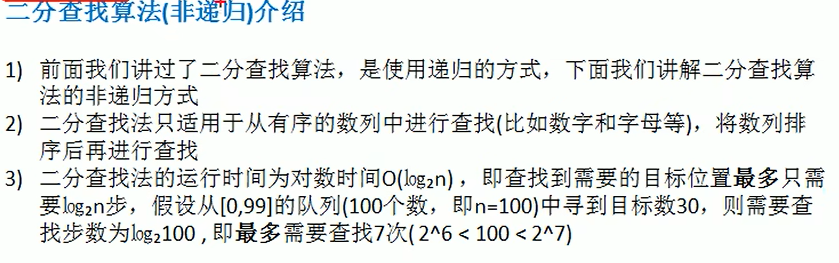

## 分治算法(Divide and Conquer)

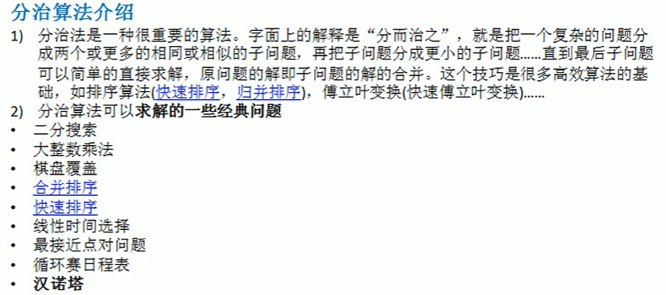

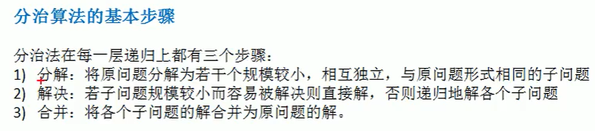

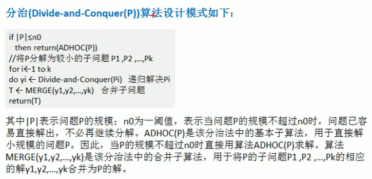

## 动态规划(Dynamic Programming, DP)

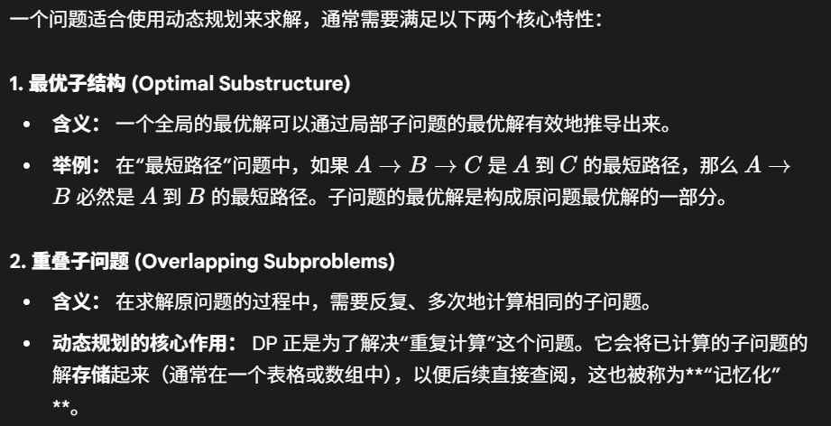

求解DP问题的步骤：

1、明确问题和决策

​	确定最优化目标，同时明确在每一步中面临的决策是什么（如背包问题中决策是“选”或者“不选”当前物品）

2、定义状态

​	状态通常是原问题的简化或子问题，需要包含所有必要的信息，通常使用一个DP数组来表示，例如DP[i]或者 DP [i] [j], 需要清楚地知道DP数组代表的实际意义是什么

3、推导状态转移方程

​	描述了如何从已知（或已计算的）的子状态推导出当前状态的最优解

4、确定边界条件

​	递推过程的起点，用于初始化DP数组。

5、自底向上实现

### Fibonacci Sequence

```java
// 使用DP来解决Fibonacci Sequence
// f(0) = 0; f(1) = 1; f(n) = f(n - 1) + f(n - 2) ,n≥2

/*1、问题与决策识别
	问题：求解f(n)
	决策：f(n) = f(n - 1) + f(n - 2)
*/

/*2、定义状态（定义DP数组）
	DP[i] = f(i)
*/

/*3、推导状态转移方程
	DP[i] = DP[i - 1] + DP[i - 2];
*/

/*4、确定边界条件
	DP[0] = 0; DP[1] = 1;
*/
// 使用递归会产生大量的重叠子问题。使用DP将相关子问题存储到DP[]中
// 自底向上实现
public class FibonacciDP{
    public static int fibonacci(int n){
        if(n <= 1){
            return n;
        }
        
        // 定义状态
        int[] dp = new int[n + 1];
        
        // 边界条件
        dp[0] = 0;
        dp[1] = 1;
        
        // 自底向上计算
        for(int i = 2; i <= n; i++){
            dp[i] = dp[i - 1] + dp[i - 2];
        }
        return dp[n];
    }
}

// 还有使用两个值进行循环迭代的算法
```


### 01背包问题（装入的物品不能重复）

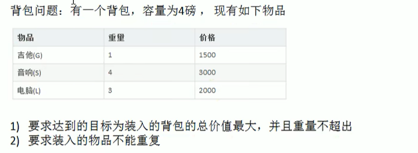

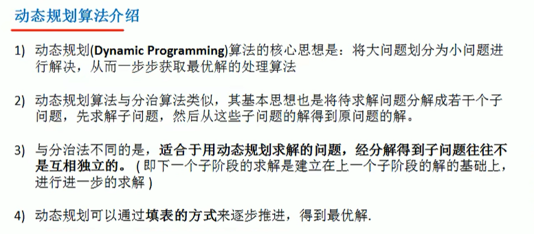

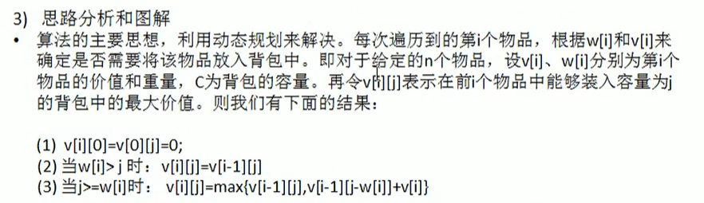

(1)代表表格的第一行和第一列为0

(2)当准备加入新增的商品的容量大于当前背包的容量，就直接使用上一个单元格的装入策略

(3)

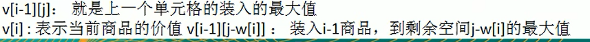


```java
// 选择是否放入物品，使得容量为W的背包的价值最大

/* 定义状态
	i表示当前考虑前i个物品即[1,i],这里的考虑指可以放入也可以不放入
	j表示背包的最大容量
	dp[i][j]	在只考虑前i个物品，且背包最大容量为j时的最大总价值
*/

/* 状态转移方程
	对于第i个物品:
	if(j < w[i])即背包容量不足，只能不装入
	dp[i][j] = dp[i - 1][j];
	
	else 有两种选择：放入或者不放入,dp[i][j] 选择两者中价值较大的
	（1）不放入第i个物品
		最大价值为只考虑前i-1个物品，且容量仍为j时的最大价值
		value1 = dp[i - 1][j]
	（2）放入第i个物品
		如果选择放入，必须满足背包的最大容量j可以装下它，即j > w[i]
        然后有剩余的 j - w[i]的容量给前i - 1个物品分配
        value2 = dp[i - 1][j - w[i]] + v[i]
     dp[i][j] = max(value1, value2) 
*/

/* 确定边界条件
	i = 0（不考虑任何物品） 或者 j = 0（背包容量为0）
    dp[0][j] = 0;
    dp[i][0] = 0;
*/
```

### 完全背包


### 多重背包


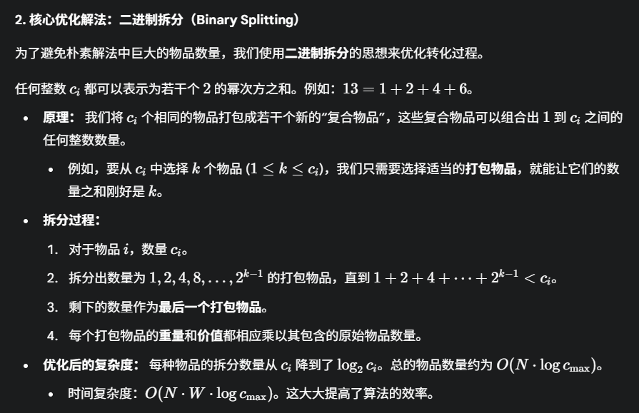

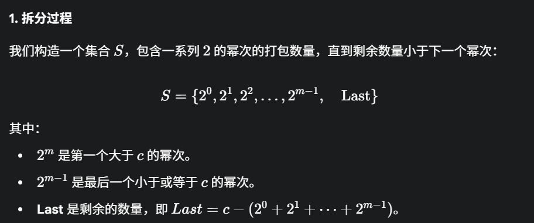

```java
// 二进制拆分
private static List<Item> binarySplit(int[] weights, int[] values, int[] counts){
    ArrayList<Item> items = new ArrayList<>();
    int N = weight.length;
    
    for(int i = 0; i <= N; i++){
        int weight = weights[i];
        int value = values[i];
        int count = counts[i];
        
        for(int k = 1; count > 0; k *= 2){
            int num = Math.min(k, count);	
            //注意这是min,因为之后要更新count，然后继续拆分下去
            items.add(new Item(weight * num, value * num, i, num));
            count -= num;
        }
    }
    return items;
}
```

## KMP算法-字符串匹配问题

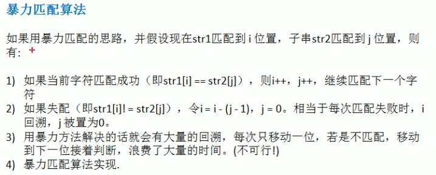


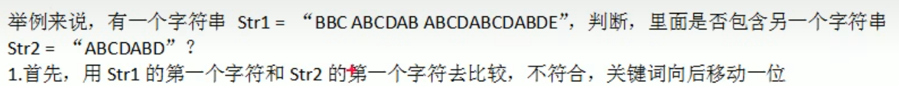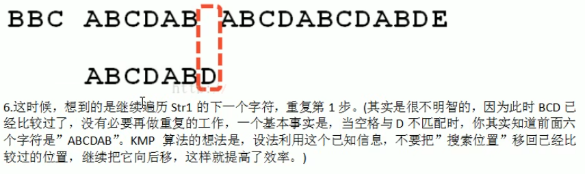

> BCD 已经比较过的意思是在ABCDAB 与原串不匹配的时候 i 没有必要继续从B继续匹配了，直接找到下一个A

**部分搜索词（部分匹配值） **

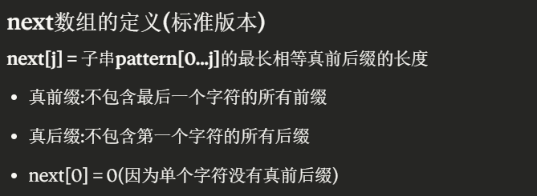

## 贪心算法

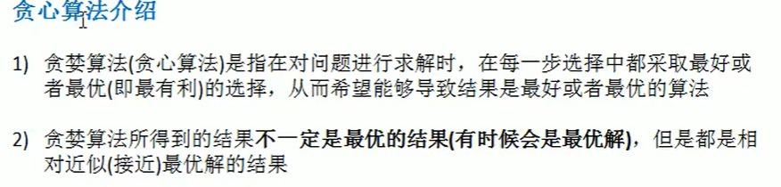

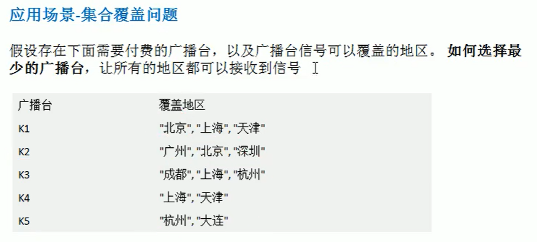

含有n个元素的集合，子集个数为2<sup>n</sup>，真子集个数为2<sup>n</sup> - 1 ==> 穷举时间复杂度高

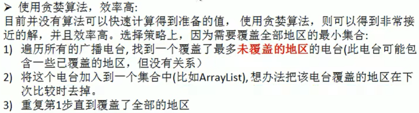

### Prim算法

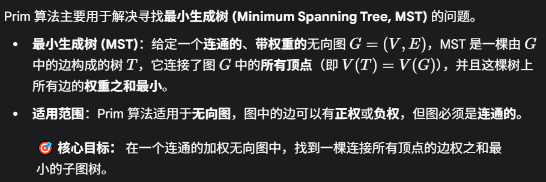

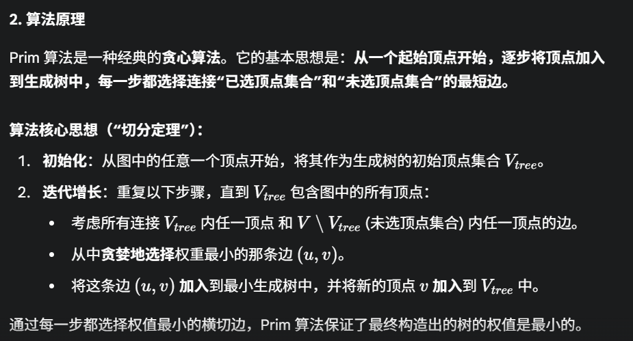

### Kruskal算法

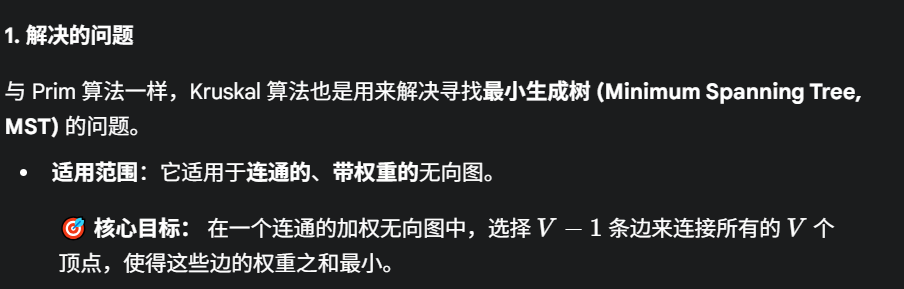

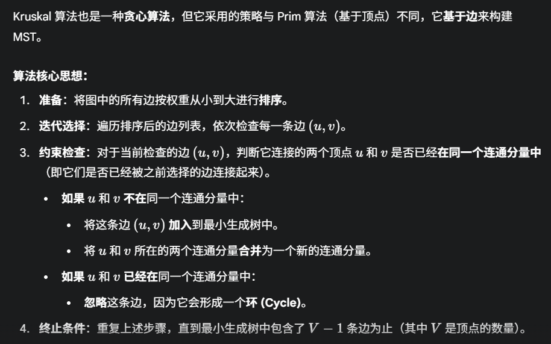

### Dijkstra算法

迪杰斯特拉算法

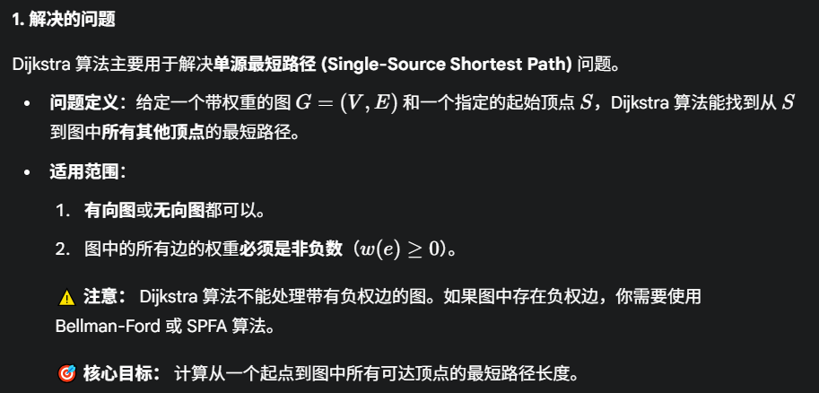

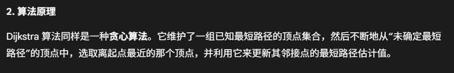

### Floyed算法

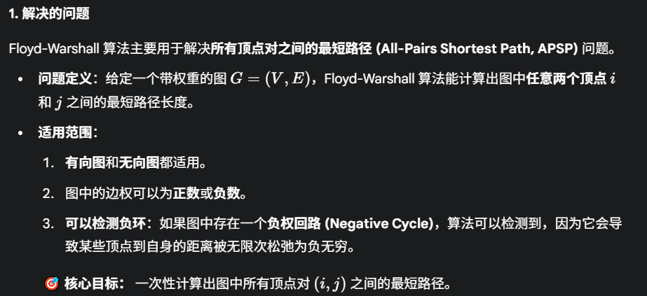

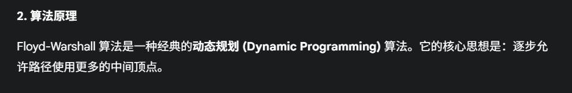

### 骑士周游问题（马踏棋盘算法）

