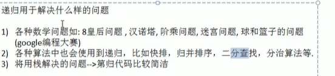
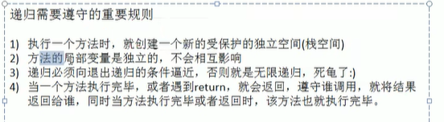
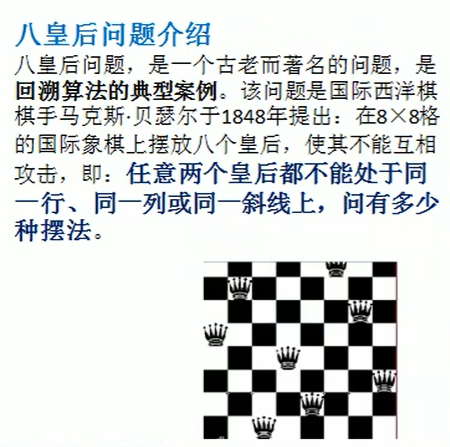
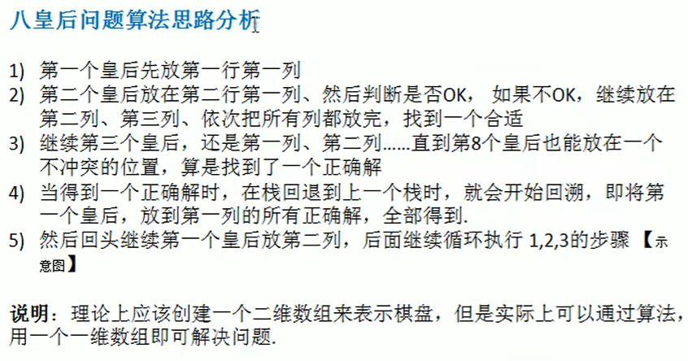

# 递归（recursion）

2)的补充，如果方法中使用的是引用类型的变量，则会共享该局部变量

违反 3）会出现一个经典的错误：stackOverflowError

## 八皇后问题

使用一维数组来表示棋盘，arr[8] = [0, 4, 7, 5, 2, 6, 1, 3]

数组的下标表示第几个皇后，即第几行，数组的值 + 1表示该皇后应该放在哪一列上。

**一共有92种摆法。**