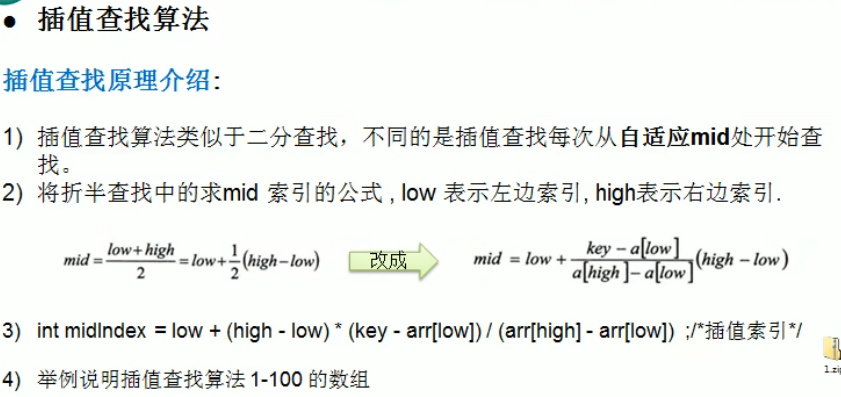
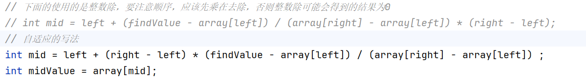
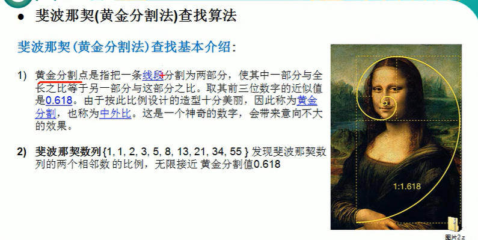
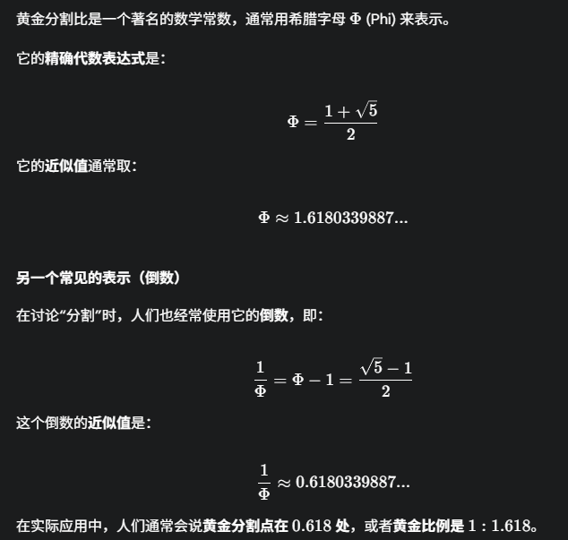
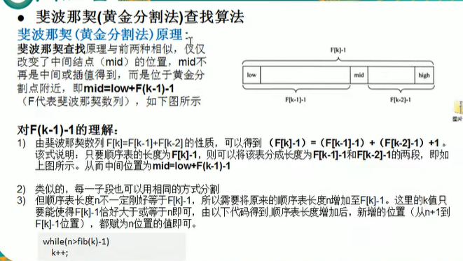

# 查找

## 线性查找

## 二分查找

> 要求数组有序

含有递归形式与非递归形式

## 插值查找

> 要求数组有序

> 要注意整数除的问题

## 斐波拉契（黄金分割法）查找算法

> 要求数组有序

F[k] - 1 = (F[k - 1] - 1) + (F[k - 2] - 1) + 1 

上面的公式说明只要顺序表的长度为 F[k] - 1,着可以把顺序表分为分成长度为 F[k-1]-1 和 F[k-2]-1}的两段，然后那个+1即为我们需要寻找的mid位置。

根据上面的那个图可以得到 mid = low + F(k - 1) - 1