# 排序

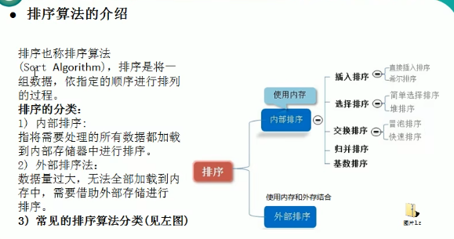

* 基数排序：桶排序的扩展

## 算法-时间复杂度

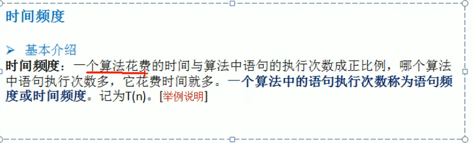

忽略常数项，忽略低次项，忽略系数（看情况吧，有的时候系数还是比较重要的，不过如果是O复杂度确实可以忽略系数）

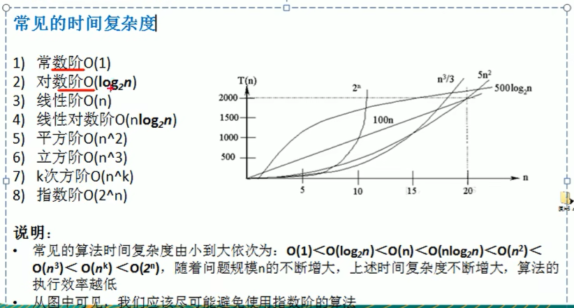

**O(n!)**的时间复杂度最大。

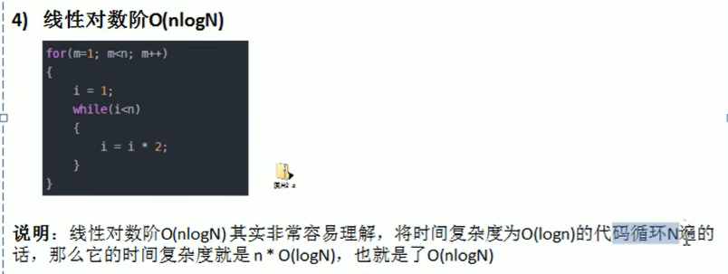

## 常用排序算法总结和对比

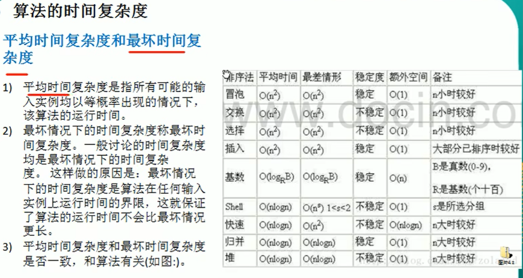

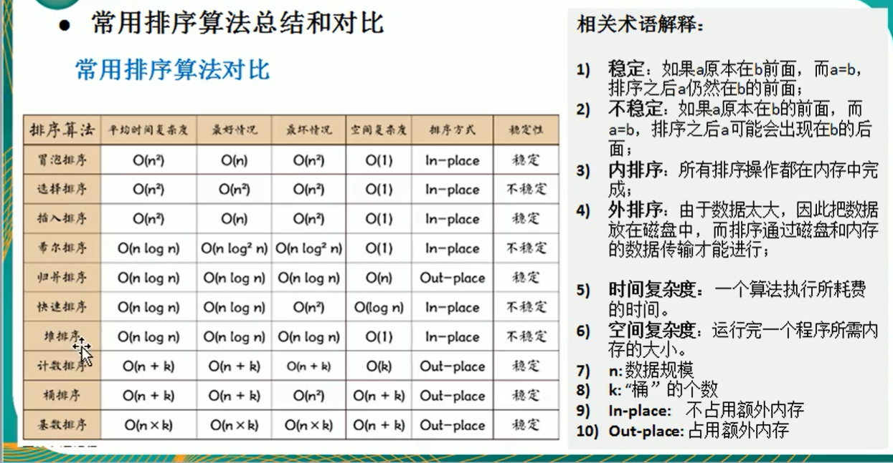

* 希尔排序的空间复杂度为O(1)，且不需要用到递归（栈）

## 空间复杂度

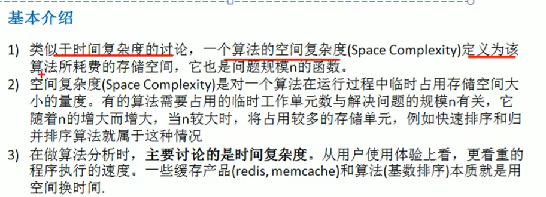

## 创建数组的方法

**标注数组（使用 [ ] ）**

* int[] array = {1,2,3}; // 使用{}进行初始化
* int[] array = new int[]{1,2,3}; // 使用new关键字配合使用{}
* int[] array = new int[5];  // 先创建再赋值

**ArrayList（动态数组）**

* ArrayList list = new ArrayList(); // 不指定类型（不推荐）
* ArrayList<Integer> list = new ArrayList(); // 使用泛型（推荐）
* ArrayList<Integer> list = new ArrayList(20);  // 指定初始容量

常用方法：

* add(elem)	add(index,elem)
* get(index)
* size()
* isEmpty()
* contains(elem) => boolean
* indexOf(elem) => index: int
* set(index,newElem)
* remove(index)     remove(elem)
* clear()

## 插入排序

### 直接插入排序

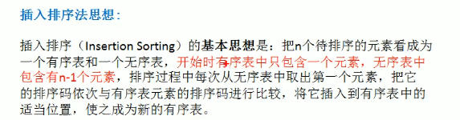

### 希尔排序

希尔排序也叫缩小增量排序，是一种分组插入排序。

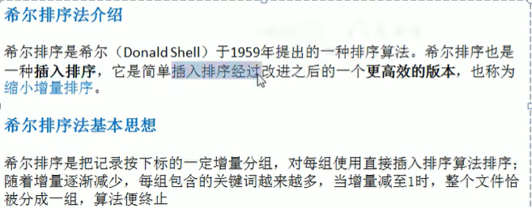

插入时可以采用交换法或者移动法

#### 交换法

#### 移动法

## 选择排序

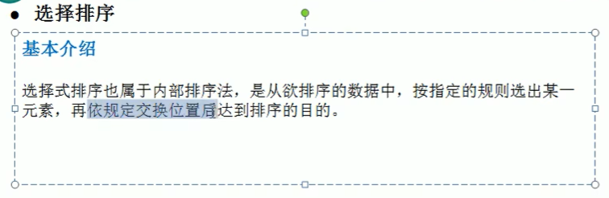

### 简单选择排序

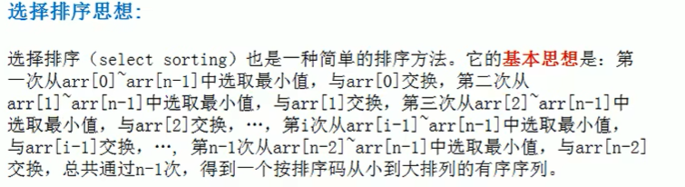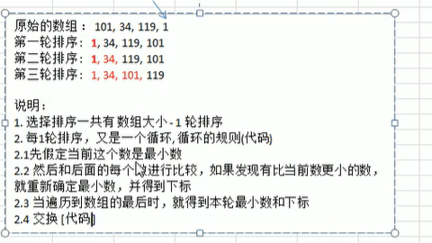

### 堆排序

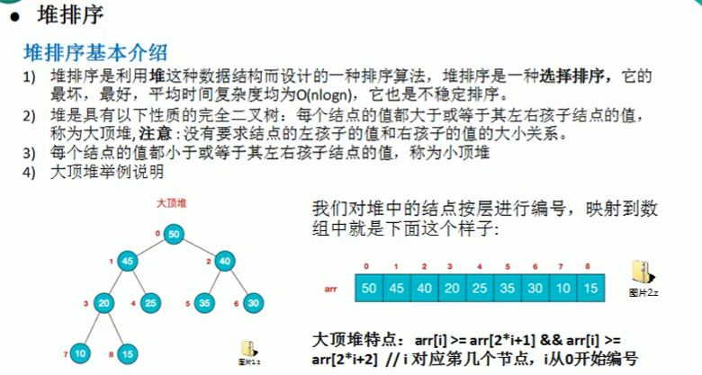

堆分为大顶堆和小顶堆。

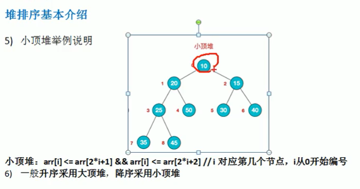

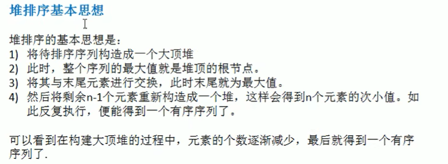

利用**顺序存储二叉树**，将完全二叉树转变为**数组**，所以堆排序中不需要实际用到树这种结构。

**堆排序的步骤**

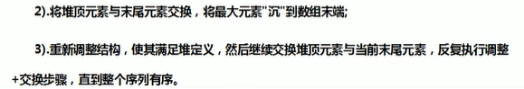

大顶堆：从小到大顺序排序。小顶堆：逆序

## 交换排序

### 冒泡排序

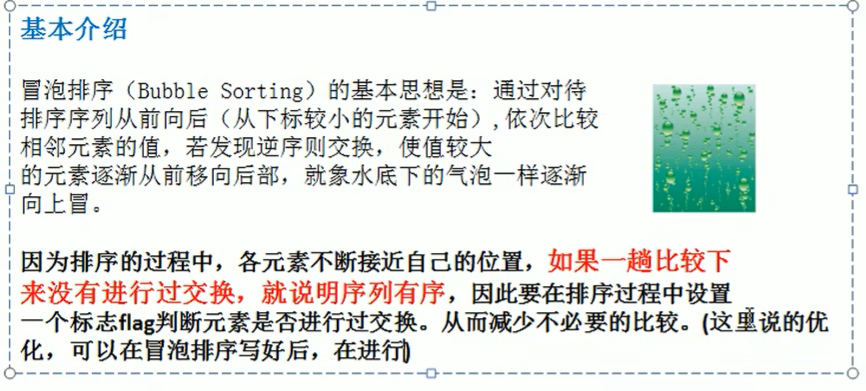

### 快速排序

## 归并排序

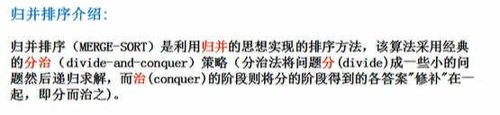

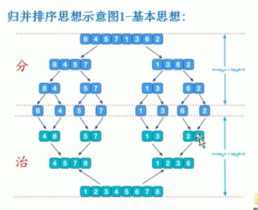

## 基数排序

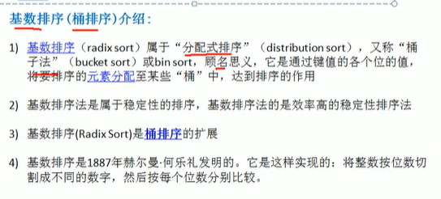

每一次重新放入桶中，可以保证 比当前正在排列的位数低 的那些位数在一个桶中是有序的。

* 第一轮按照个位数字进行排序，然后依次从各个“桶”中取出

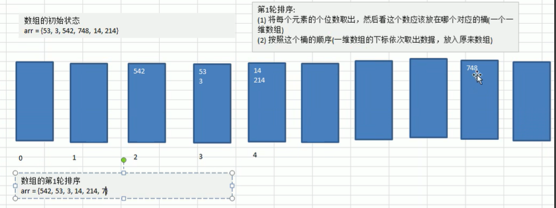

* 第二轮按照十位数进行排序，然后依次从各个“桶”中取出

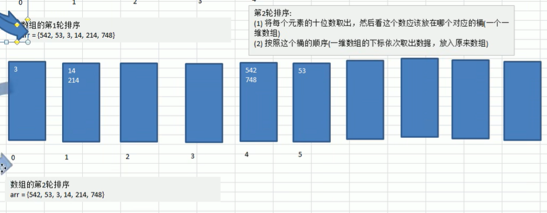

* 第三轮

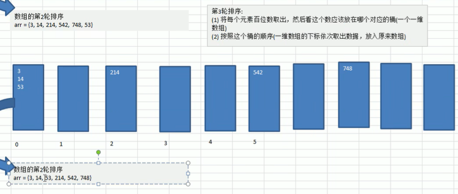
