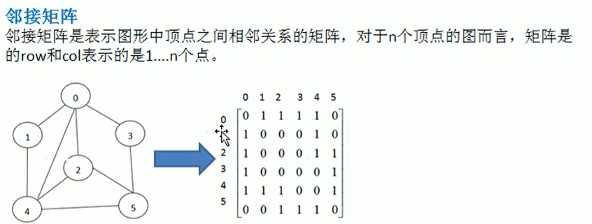
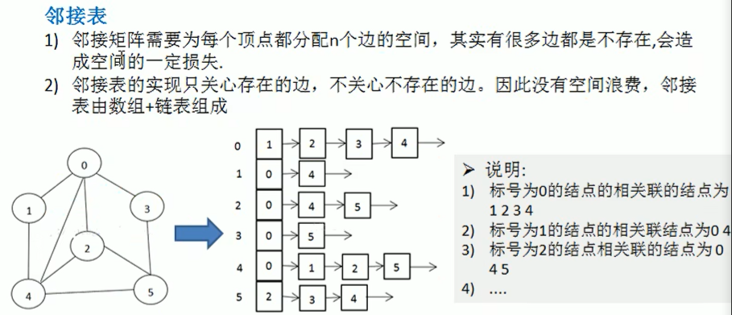
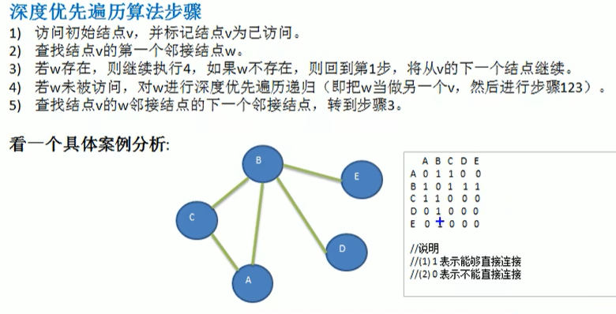
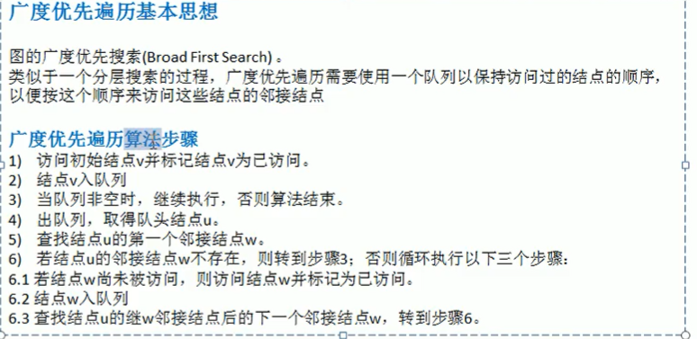

# 图（graph）

用来表示多对多的关系。

Vertex, Edge, Path, 无向图，有向图，带权图（网）

## 图的表示方式

### 邻接矩阵（二维数组）

0-表示不联通

1-联通

### 邻接表（链表）

## 图的遍历方式

### 深度优先遍历（Depth First Search, DFS）

### 广度优先遍历（Broad First Seach）

不能使用递归，而应该使用队列
