# 栈

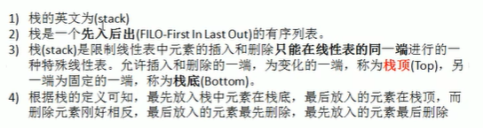

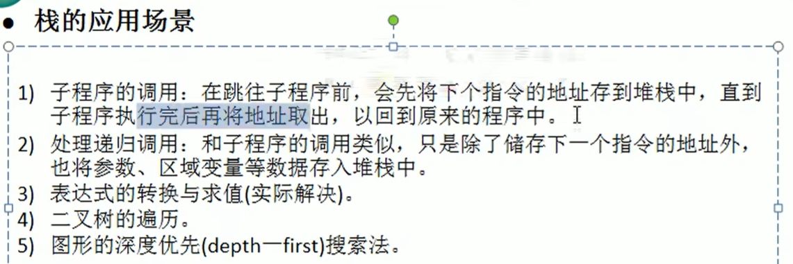

3）为中缀表达式转后缀表达式

## 中缀表达式计算

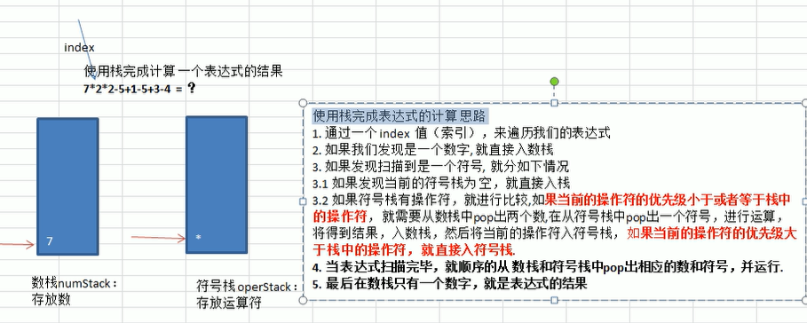

**老韩的方法有问题，具体如下：**

topPriority（栈顶符号优先级） >= currPriority（当前符号优先级）

​	 =>  出栈栈顶符号，但是只出栈一个操作符

所以当遇到 10-4/2+3 这类的表达式的时候，处理 + 时，只会出栈 / ， 然后栈中会存在 - 和 + ，然后先计算 + ，最终得到的结果为 10 - (4/2+3)= 5

**正确做法为循环处理所有优先级高于或等于当前运算符的栈内运算符**

即 currPriority <= topPriority 

​	 => 符号栈持续出栈直至  operitorStack.isEmpty() || currPriority < topPrioriry

```java
int curPrioriyt = operatorStack.priority(ch);

// 循环处理所有优先级高于或等于当前运算符的栈内运算符
// currPriority <= topPriority => 符号栈持续出栈直至 operitorStack.isEmpty() || currPriority < topPrioriry
while (!operatorStack.isEmpty() && operatorStack.priority((char) operatorStack.peek()) >= curPrioriyt){
    operator = (char) operatorStack.pop();
    num2 = numStack.pop();
    num1 = numStack.pop();
    res = numStack.cal(num1, num2, operator);
    numStack.push(res);
    }
    // 当前符号入符号栈
    operatorStack.push(ch);
}
```


> java 中的 char与int
>
> 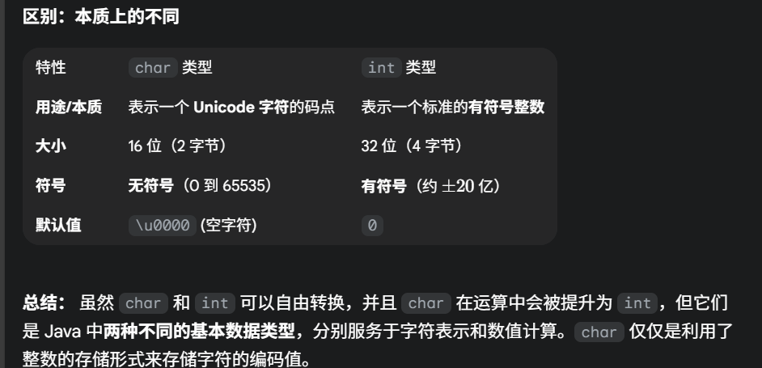

> 有关于字符串和其它类型的转换
>
> * 基本数据类型转换成字符串
>
>   ```java
>   int i = 100;
>   String s1 = String.valueOf(i);  // 推荐方法
>   String s2 = Integer.toString(i);
>   String s3 = i + "";  // 简单但效率较低
>   ```
>
>   

> * 字符串转为基本数据类型(包装类.parseInt(string))
>
>   ```java
>   String s = "100";
>   int i = Integer.parseInt(s);
>   double d = Double.parseDouble("3.14");
>   boolean b = Boolean.parseBoolean("true");
>   ```
>
>   


## 前缀、中缀、后缀表达式

### 前缀表达式（波兰表达式）

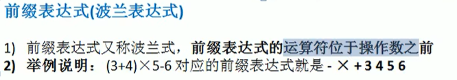

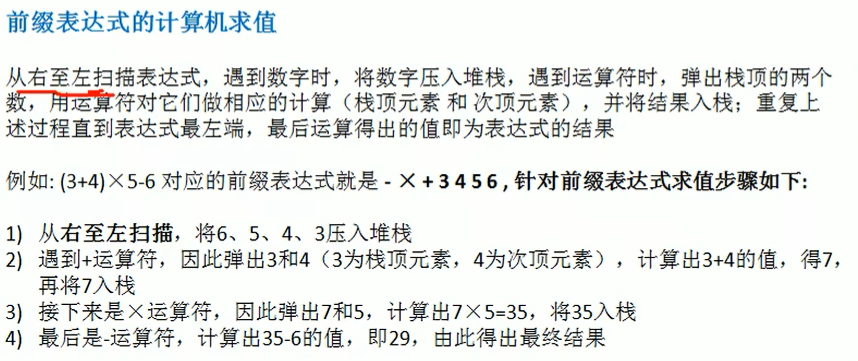

> 先pop出来的操作数作为第一个操作数（操作符前面的那个数）

### 中缀表达式

计算机不方便确定中缀表达式中的操作符的优先级，所以一般会转换为其他形式的表达式，比如说**后缀表达式（逆波兰表达式）**。

### 后缀表达式

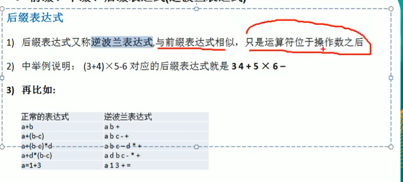

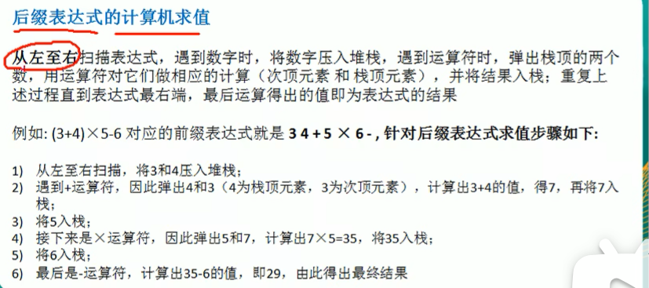

> 先pop出来的操作数作为第二个操作数（操作符后面的那个数）
>
> pop两次的数作为第一个操作数


## 后缀表达式（逆波兰表达式）计算

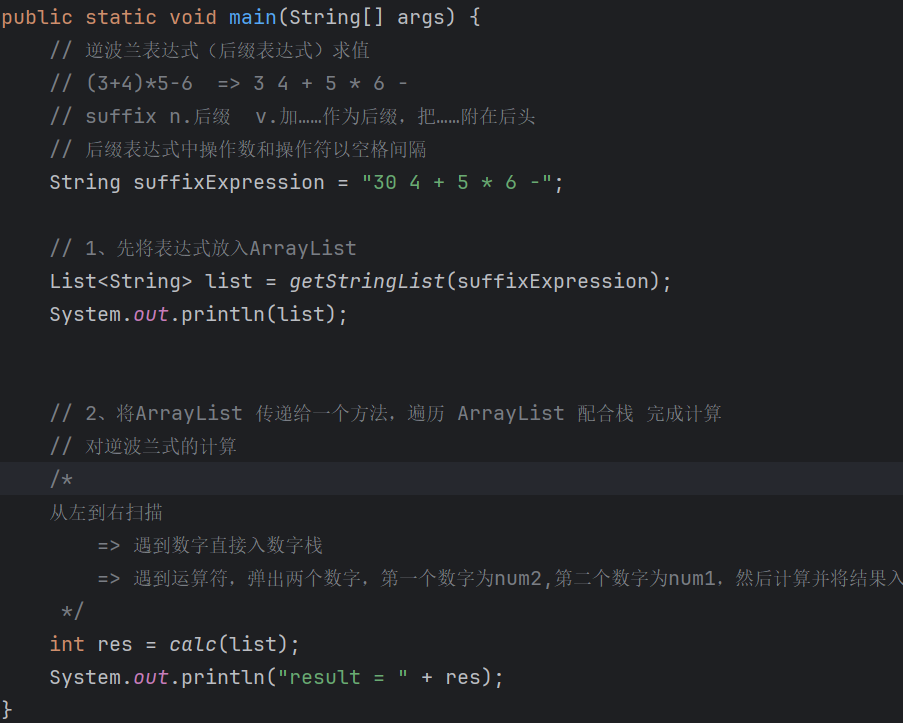

## 中缀表达式转后缀表达式

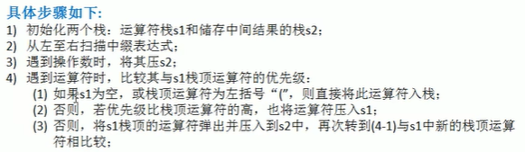

> 这次老韩写的是循环出栈，详见 4.3 

**1 + ((2 + 3 ) * 4) - 5**  => **hh **

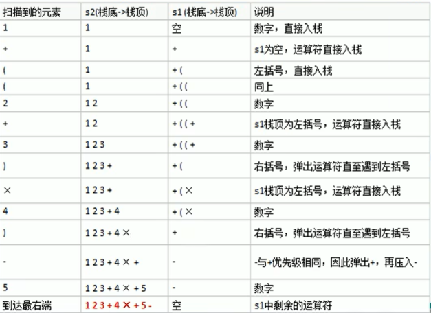

### 正则表达式

regular expression ，简称 regex

正则表达式是由普通字符（字母）和特殊字符（成为元字符）组成的字符串，用于一种搜索模式。

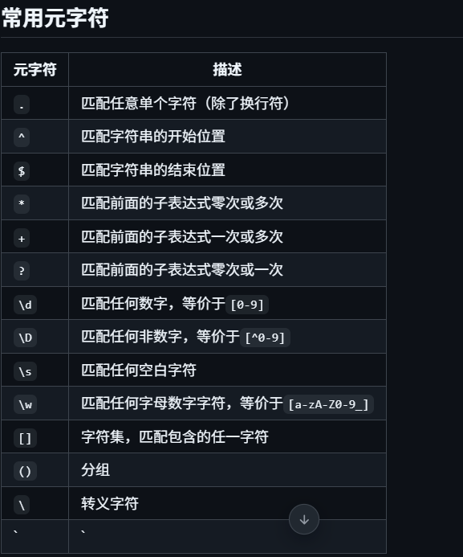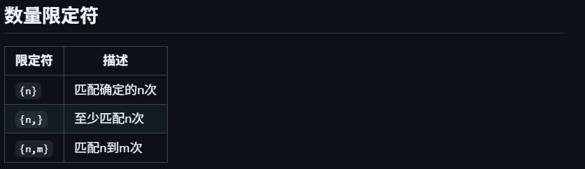

```java
// 基本匹配
boolean isMatch = Pattern.matches("\\d+", "12345");  // true

// 创建Pattern对象
Pattern pattern = Pattern.compile("\\d+");
Matcher matcher = pattern.matcher("12345");
boolean found = matcher.matches();  // true

// String类的正则方法
String s = "Hello123World456";
String[] numbers = s.split("\\D+");  // ["", "123", "456"]
boolean matches = "12345".matches("\\d+");  // true
String replaced = s.replaceAll("\\d+", "#");  // "Hello#World#"
```

```java
// 测试不同数字格式
String[] testNumbers = {"123", "123.45", ".45", "123.", "a123"};
String pattern = "\\d+\\.?\\d*|\\.\\d+";

for (String number : testNumbers) {
    System.out.println(number + " matches? " + number.matches(pattern));
}

/* 输出:
123 matches? true
123.45 matches? true
.45 matches? true
123. matches? true
a123 matches? false
*/
```

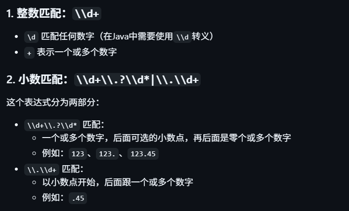

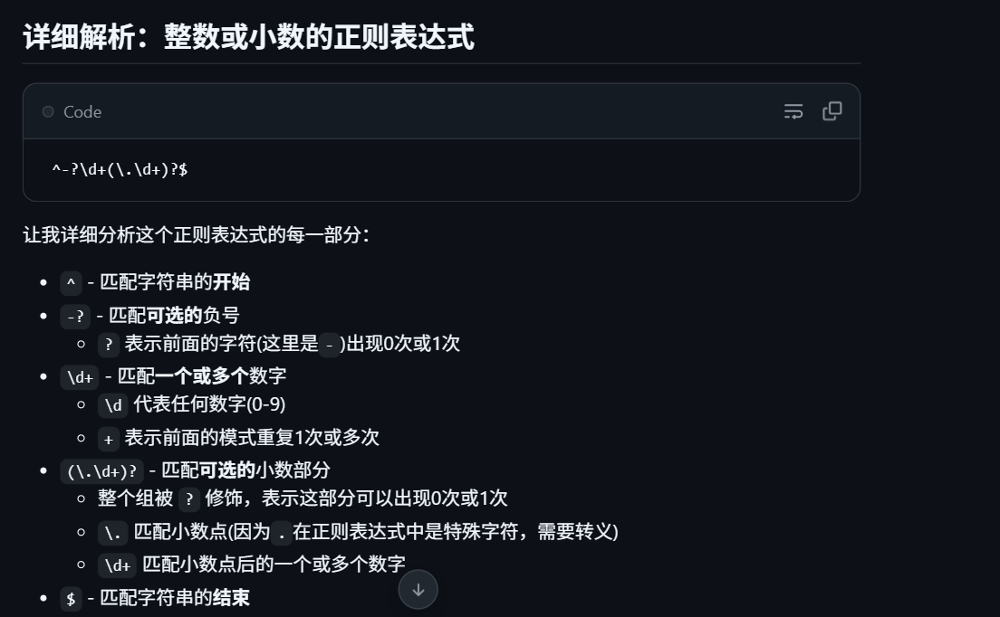
