# 树

## 二叉树

**每个节点最多只能有两个子节点。**

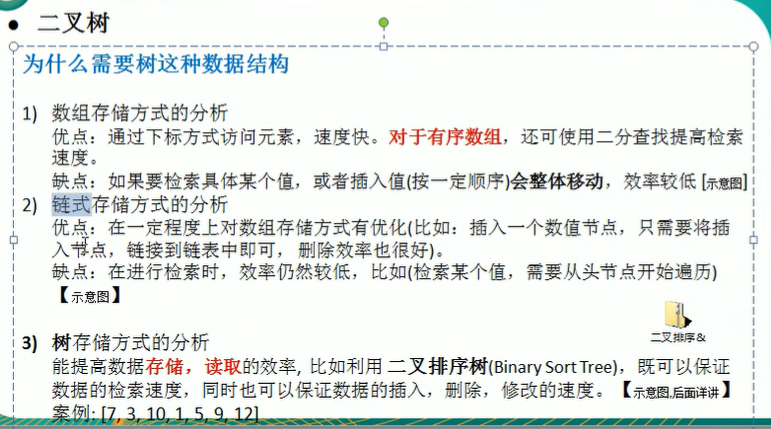

 满二叉树：所有叶子节点都为于最后一层，且节点总数为2^n - 1(n为层数)

完全二叉树：所有叶子节点位于最后一层或者倒数第二层，且“形状”需要与完全二叉树一样。

### 前序遍历

根左右

### 中序遍历

左根右

### 后序遍历

左右根

## 顺序存储二叉树

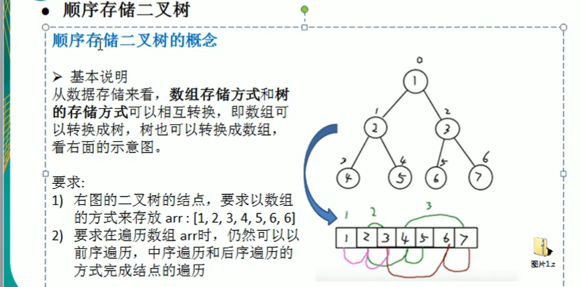

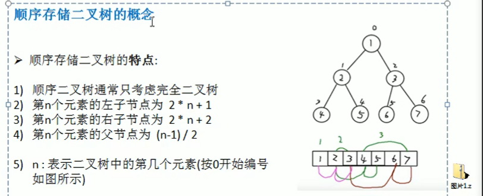

这里数据的编号采用数组的下标（从零开始）

## 线索化二叉树

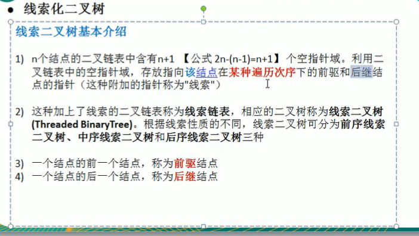

按照**某种遍历**顺序来利用n+1个闲置的空指针域，不同的遍历方式会得到不同的线索二叉树。

线索二叉树的right指针可能指向右子树或者后继节点，left指针可能指向左子树或者前驱节点。

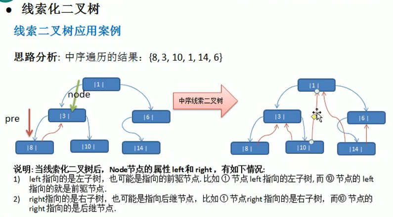

## 哈夫曼树

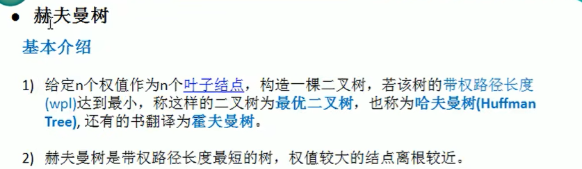

WPL(weighted path length):所有叶子节点的带权路径长度

WPL最小的二叉树即为最优二叉树（哈夫曼树）。

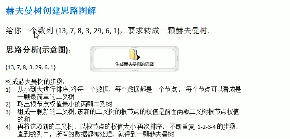

取出根节点权值最小的两棵二叉树构成一棵新的二叉树，默认规则是左小右大（即左子树的权值较小而右子树的权值较大）。

## 哈夫曼编码

前缀编码：字符的编码都不能是其他字符的编码的前缀。即不能匹配到重复的编码，解码没有二义性。部分变长编码不是前缀编码。

**哈夫曼编码是前缀编码。*，并且哈夫曼压缩是无损压缩。

**编码步骤**:

* 1、统计字符串中所有字符出现的次数
* 2、将出现次数作为权值构建Huffman树
* 3、进行Huffman编码，左零右一
* 4、按照编码规定进行字符串的编码

## 二叉排序树（BST）

树存储方式可以提高存储和操作的效率。

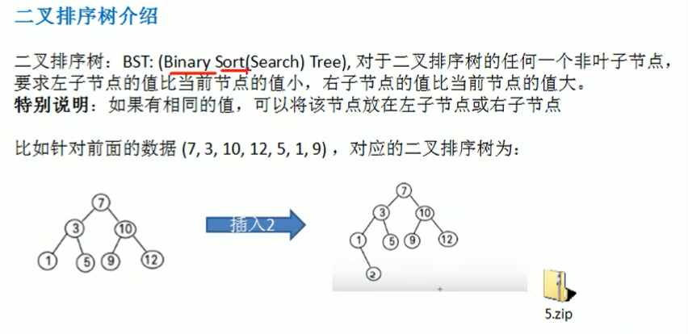

### 删除节点

* 叶子节点

  (1)找到targetNode和其父节点parentNode(可能是null)

  (2)确定targetNode是parentNode的左子树还是右子树，然后置空

* 只有一棵子树的节点

  (1)找到targetNode和其父节点parentNode(可能是null)

  (2)确定targetNode是parentNode的左子树还是右子树

  (3)确定targetNode含有左子树还是右子树

  (4)parentNode连接targetNode的左子树或者右子树

* 含有两棵子树的节点

  将targetNode的左子树的最大值节点（叶子节点）或者右子树的最小值节点（叶子节点）直接替换targetNode

## 平衡二叉树（AVL树）

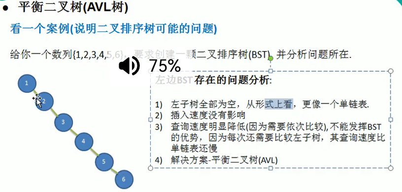

AVL: Adelson-Velsky and Landis tree，由这两个人发明，所以取名为AVL树。也叫平衡二叉搜索树（self- balancing binary search tree）

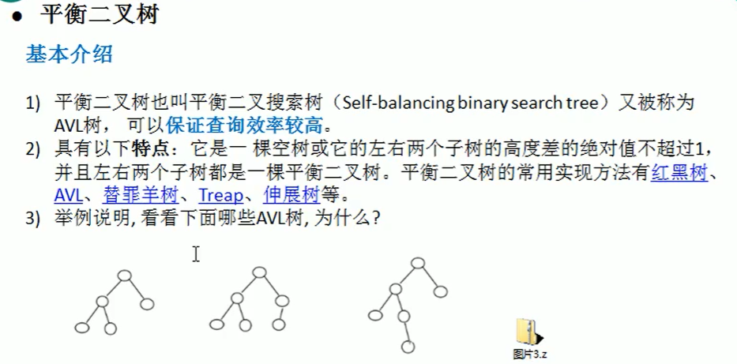

根据“新插入的节点”相对于“导致失衡的节点”的路径位置来命名。

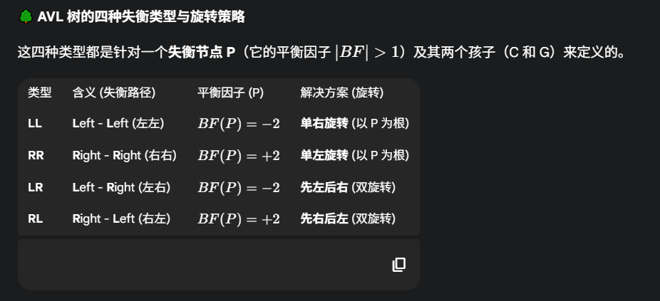

### RR——左旋转

int[] arr = {4,3,6,5,7,8}

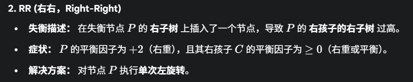

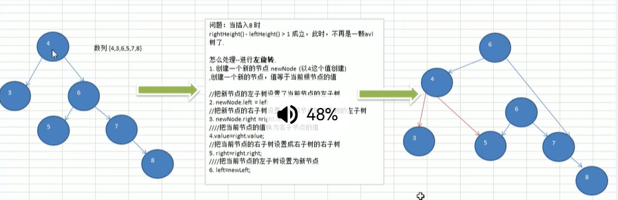

### LL——右旋转

int[] arr = {10,12,8,9,7,6}

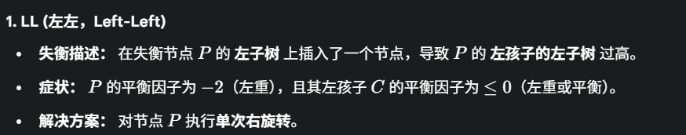

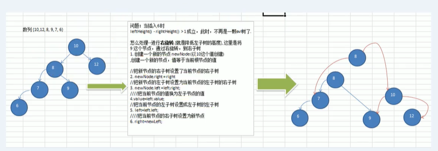

### 双旋转

int[] arr = {10,11,7,6,8,9}

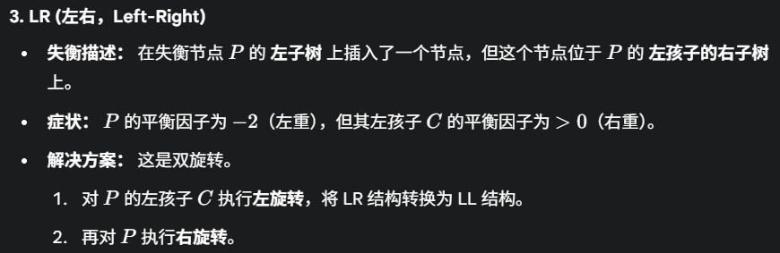

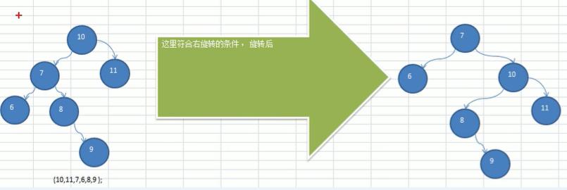

还有一种情况老韩没有说，如下：

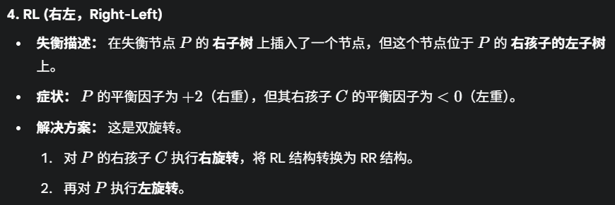

## 多叉树（multiway tree）

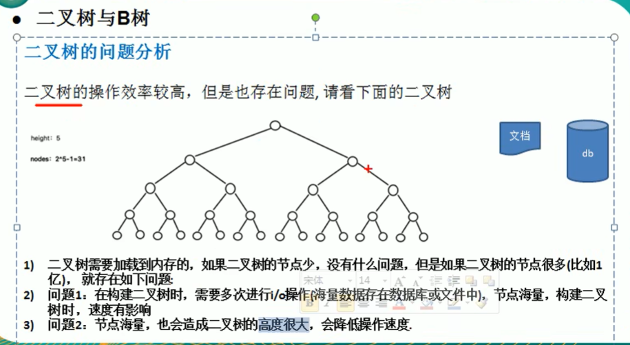

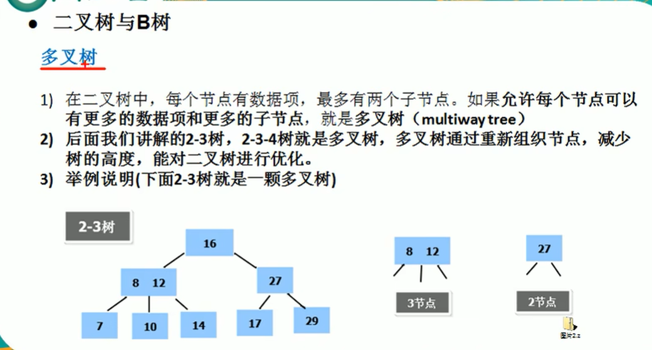

节点的度：节点的孩子个数

树的度：max(节点的度)

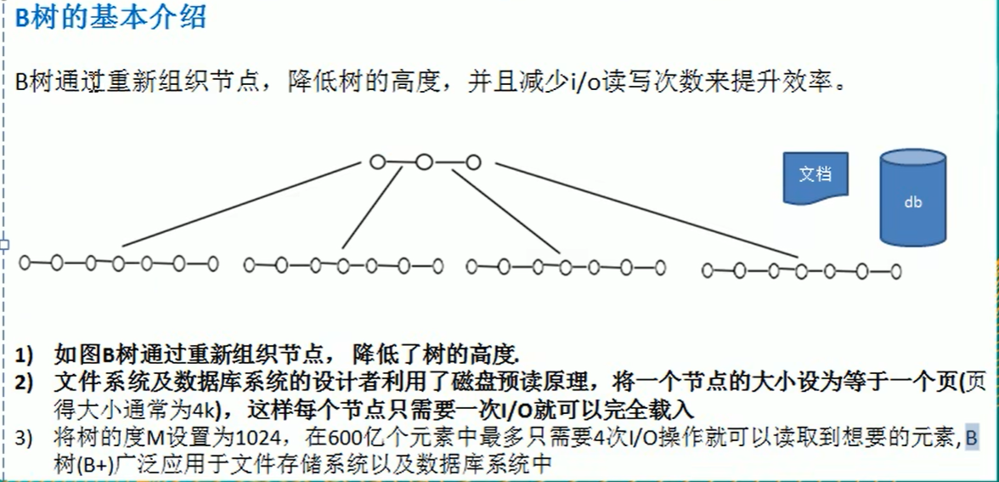

### 2-3树

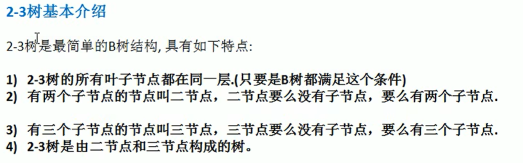

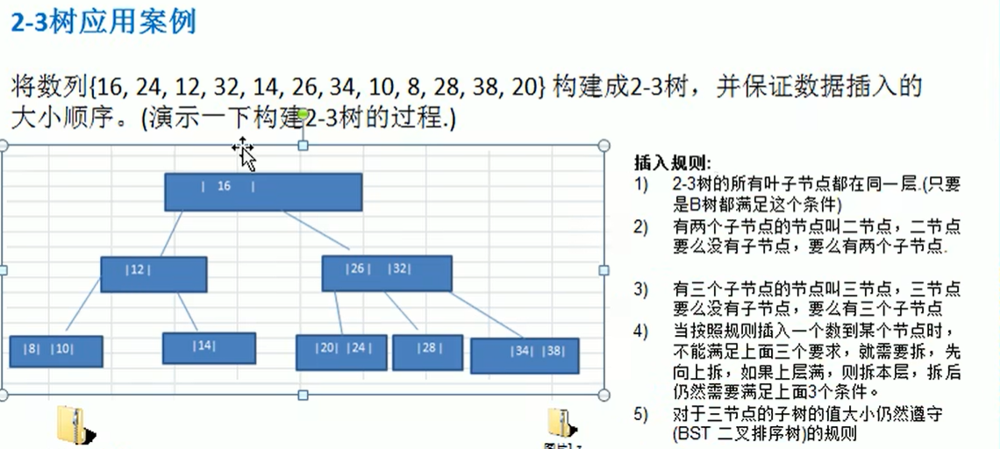

### B树

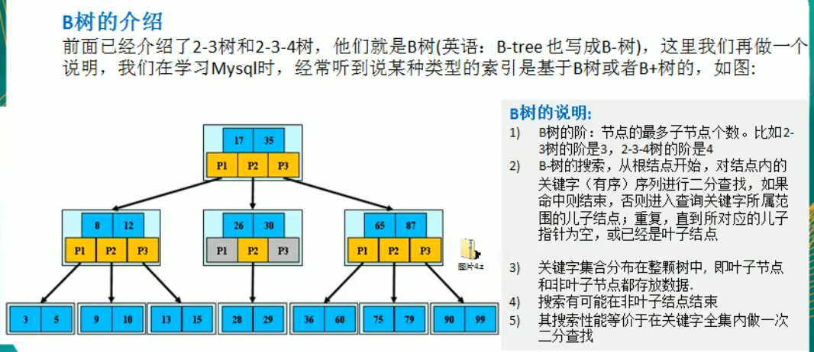

### B+树

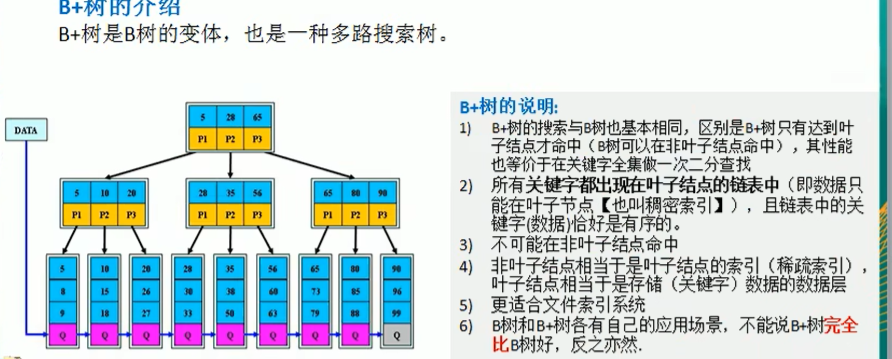

稀疏索引和稠密索引，适合文件索引管理系统。

### B*树

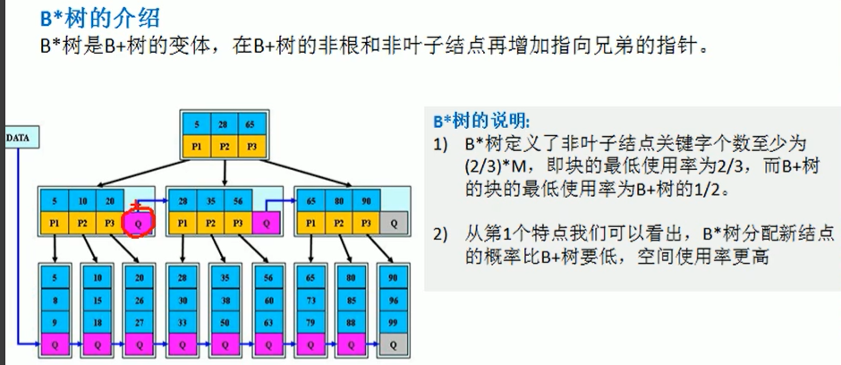
